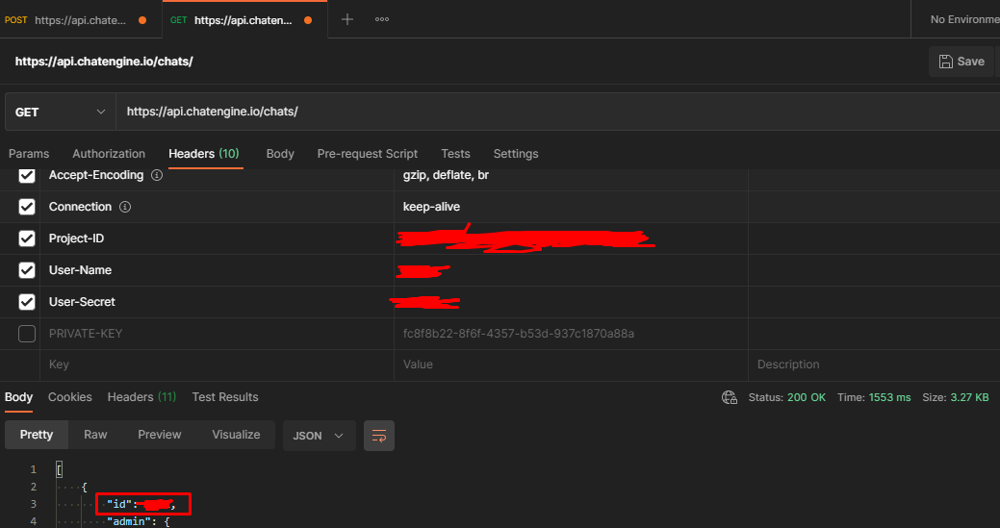

# Serverless React ChatApp

Made with [ChatEngine](chatengine.io) and React. In order to make your own app, please follow JavaScriptMastery's [tutorial.](https://www.youtube.com/watch?v=jcOKU9f86XE)

</img>
>
---

## SignUp

To make a SignUp form: 
- First, get your ChatID using your ProjectID, and a chat admin user: 

- Second, make your SignUp component using ChatID, ProjectID and Private Key as constants.

- Third, using [ChatEngine Rest API](https://chatengine.io/docs/server_rest), add a user to your project and immediately put it in the chat:
```javascript
import axios from 'axios'

axios.post(
	'https://api.chatengine.io/projects/people/',
	{ 'username': 'adam', 'secret': 'pass1234', 'first_name': 'Adam', 'last_name': 'Smith' },
	{ headers: { "Private-Key": '0000-00-00-0000' } }
)
.then((response) => console.log(response.data))
.catch((error) => console.log(error))
```
```javascript
import { addPerson } from 'react-chat-engine';

const authObject = {'Project-ID': '0000-00-00-0000', 'User-Name': 'adam', 'User-Secret': 'pass1234'}
const chatID = 1
const username = 'adam'
const callback = (chatID, data) => console.log(chatID, data)

addPerson(authObject, chatID, username, callback)
```
- Fourth, link SignUp Component in Login Component, then add it to App.js


---
## PWA

- To make your React Chat App work as a PWA, just add a [serviceWorker](src/serviceWorker.js) in your src folder.

- Then just import the service worker inside index.js and register it:
```javascript
import * as serviceWorker from './serviceWorker';

serviceWorker.register();
```
- Finally, follow [LightHouse](https://developers.google.com/web/tools/lighthouse) instructions to improve your PWA.
---

## License
[MIT](https://choosealicense.com/licenses/mit/)